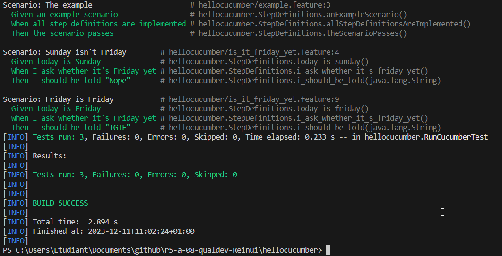
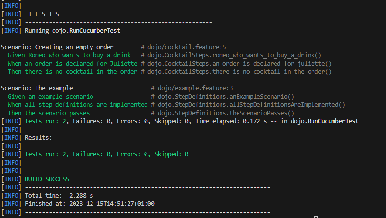

= R5.A.08 -- Dépôt pour les TPs
:icons: font
:MoSCoW: https://fr.wikipedia.org/wiki/M%C3%A9thode_MoSCoW[MoSCoW]

Ce dépôt concerne les rendus de mailto:A_changer@etu.univ-tlse2.fr[Adriel Marchant].

== TP1

.Exemple de code
[source,java]
---
@Given("today is Sunday")
public void today_is_sunday() {
    // Write code here that turns the phrase above into concrete actions
    throw new io.cucumber.java.PendingException();
}
---

.contenu de is_it_friday_yet.feature 

Feature: Is it Friday yet?
  Everybody wants to know when it's Friday

  Scenario: Sunday isn't Friday
    Given today is Sunday
    When I ask whether it's Friday yet
    Then I should be told "Nope"
    
  Scenario: Friday is Friday
    Given today is Friday
    When I ask whether it's Friday yet
    Then I should be told "TGIF"

.Exemple d'image insérée en asciidoc

== TP2

 === Contenu de Order.java 

 package dojo;

import java.util.ArrayList;
import java.util.List;

public class Order {
    private String buyer ="";
    private String drinker = "";
    private List<String> cocktails = new ArrayList<>();

    public List<String> getCocktails() {
        return cocktails;
    }

    public void setCocktails(List<String> fCocktails) {
        this.cocktails = fCocktails;
    }

    public void addCocktail(String fCocktail){
        this.cocktails.add(fCocktail);
    }

    public void setBuyer(String fBuyer){
        this.buyer = fBuyer;
    }

    public String getBuyer() {
        return this.buyer;
    }

    public void setDrinker(String fDrinker){
        this.drinker = fDrinker;
    }

    public String getDrinker() {
        return this.drinker;
    }

    
}

